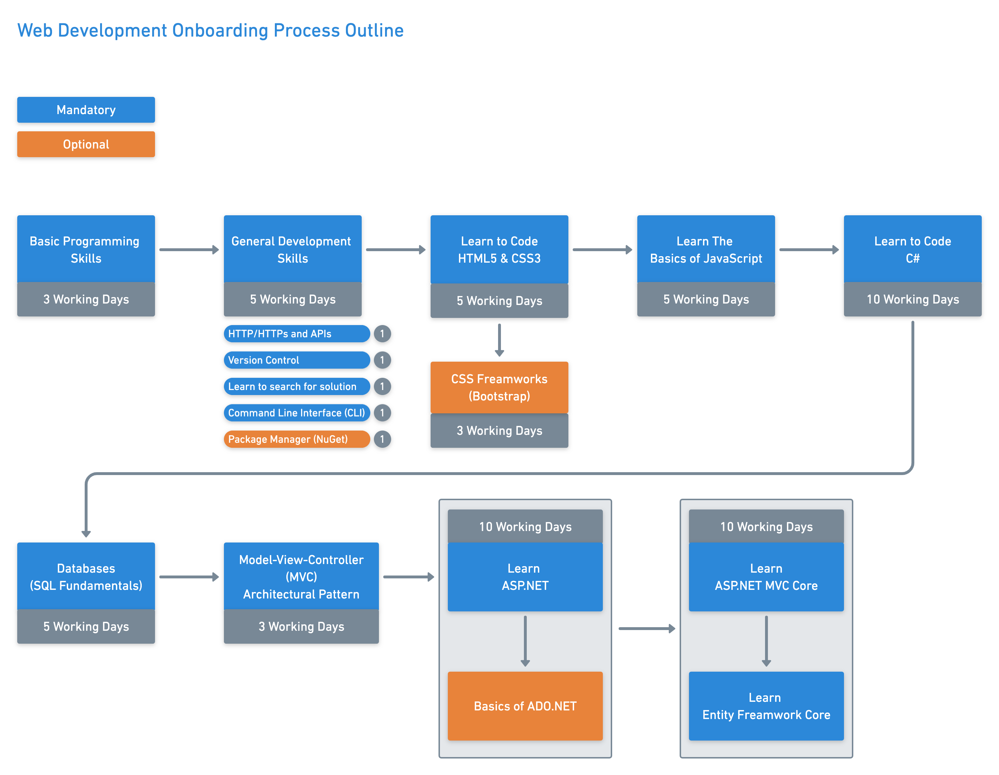
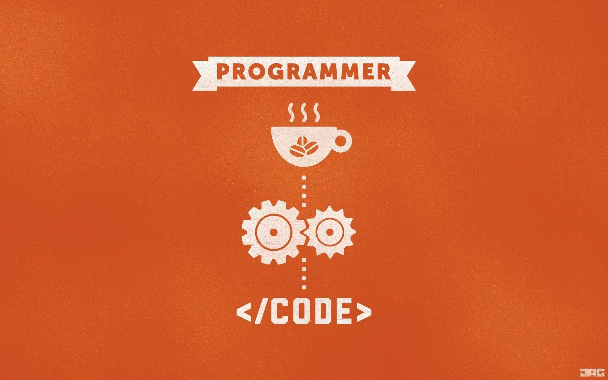

# Web Development Onboarding Process
Our goal is to provide a mechanism through which you can acquire the necessary knowledge and skills to become effective Web Developer..

Recent stats from clickboarding.com show that 69 percent of new hires are likely to stay with the company for three years if they have a positive onboarding experience.





## General Computer Programming Skills



### Intro to Computer Science - Harvard's CS50 (2018)
`Duration: `

Learn the foundations of computer science in this course. This video is lecture 0 of Harvard University's CS50 2018 course.

#### Contents
* (00:50) Introduction
* (03:13) Binary
* (09:37) Binary Lamps
* (11:20) ASCII
* (18:48) RGB
* (24:00) Finding Mike Smith
* (24:06) Computational Complexity
* (29:44) Pseudocode
* (32:36) Introducing Scratch
* (33:41) meow
* (34:04) Oscartime
* (45:16) counting sheep
* (49:18) pet the cat
* (57:07) threads
* (59:11) events
* (1:01:23) functions
* (1:06:45) Ivy's Hardest Game

[Computational Thinking & Scratch - Intro to Computer Science - Harvard's CS50 (2018)](https://www.youtube.com/watch?v=F0WoVEr0-44&list=PLWKjhJtqVAbmGw5fN5BQlwuug-8bDmabi)

### Programming Concepts By [freecodecamp](https://www.freecodecamp.org/) 
> If you work in a software development company as a non-programmer, you may wonder what the programmers do. And you hear new buzzwords everyday. This post was written with you in mind. Whether you are a sales person, a medical doctor, attorney, a business lead, or an accountant, if you’ve ever had it in mind to learn how to code, this is a good place to start.

[A Gentler Introduction to Programming](https://medium.freecodecamp.org/a-gentler-introduction-to-programming-1f57383a1b2c)
>**Task duration: 2 days.** <sub>For publication reading time plus programming concept awareness.</sub>

Recommended path: [Learn to code for free. - freecodecamp](https://www.freecodecamp.org/)

#### A Complete Beginner's Guide to Programming
> This post is going to start out by discussing what computers are at a conceptual level, and then discuss the programming fundamentals. We'll use Python in this post, but a lot of the building blocks work across programming languages, so this will still help even if you are interested in learning a different language at first.    

[A Complete Beginner's Guide to Programming](https://dev.to/aspittel/a-complete-beginner-s-guide-to-programming-2ni4)

Your **target** here is to read the publication above and practice the same programming fundamentals using [C#](https://docs.microsoft.com/en-us/dotnet/csharp/programming-guide/) programming language.

**Tip**

We recommend using C# Online Compiler like [dotnetfiddle](https://dotnetfiddle.net/).

## General Development Skills

### How does the Internet work?

> The Internet is the backbone of the Web, the technical infrastructure that makes the Web possible. At its most basic, the Internet is a large network of computers which communicate all together.

[How does the Internet work?](https://developer.mozilla.org/en-US/docs/Learn/Common_questions/How_does_the_Internet_work)

### What is the difference between webpage, website, web server, and search engine?

> In this article, we describe various web-related concepts: web pages, websites, web servers, and search engines. These terms are often confused by newcomers to the web or are incorrectly used. Let's learn what they each mean!

[What is the difference between webpage, website, web server, and search engine?](https://developer.mozilla.org/en-US/docs/Learn/Common_questions/Pages_sites_servers_and_search_engines)

### What is a web server?

> "Web server" can refer to hardware or software, or both of them working together.

[What is a web server?](https://developer.mozilla.org/en-US/docs/Learn/Common_questions/What_is_a_web_server)

### Easy Understanding of Web Protocols - HTTP and HTTPS

> Do you know that 68% of internet users believe that current laws for protecting their rights are not good enough?

> Every time Google introduces a new preference, the internet takes/ is forced to note. Something similar happened when Google announced that websites with SSL Certificate / HTTPS protocol will be preferred in search engine results. I will try to cover the fundamentals of HTTP and HTTPS protocols.

[Easy Understanding of Web Protocols - HTTP and HTTPS](https://www.izooto.com/blog/understanding-http-https-protocols)

### Why HTTPS Matters

> You should always protect all of your websites with HTTPS, even if they don’t handle sensitive communications. Aside from providing critical security and data integrity for both your websites and your users' personal information, HTTPS is a requirement for many new browser features, particularly those required for progressive web apps.

[Why HTTPS Matters](https://developers.google.com/web/fundamentals/security/encrypt-in-transit/why-https)

###  What is Source Control?

> **Source control** (or **version control**) is the practice of tracking and managing changes to code. Source control management (SCM) systems provide a running history of code development and help to resolve conflicts when merging contributions from multiple sources.

**Source Control Basics**

Whether you are writing a simple application on your own or collaborating on a large software development project as part of a team, source control is a vital component of the development process. Source code management systems allow you to track your code change, see a revision history for your code, and revert to previous versions of a project when needed. With source code management systems, you can collaborate on code with your team, isolate your work until it is ready, and quickly trouble-shoot issues by identifying who made changes and what the changes were. Source code management systems help streamline the development process and provide a centralized source for all your code.

[What is Source Control? Amazon](https://aws.amazon.com/devops/source-control/)

[Intro to Source Control: A Must-Have Tool for Programmers](https://www.youtube.com/watch?v=K0mgc3efx-A)

**Team Foundation Server (TFS)**

Team Foundation Server (commonly abbreviated to TFS) is a Microsoft product that provides source code management (either with Team Foundation Version Control or Git), reporting, requirements management, project management (for both agile software development and waterfall teams), automated builds, lab management, testing and release management capabilities. It covers the entire application lifecycle, and enables DevOps capabilities. TFS can be used as a back-end to numerous integrated development environments (IDEs) but is tailored for Microsoft Visual Studio and Eclipse on all platforms.

[What is TFS?](https://www.youtube.com/watch?v=WxQFrbkoxrw)

### 20 Google Search Tips to Use Google More Efficiently

> Millions of people use Google search every day for a variety of reasons. Students use it for school, business people use it for research, and millions more use it for entertainment. But most people may not be using Google search to its full potential.

[20 Google Search Tips to Use Google More Efficiently](https://www.lifehack.org/articles/technology/20-tips-use-google-search-efficiently.html)

### Getting Started with Command-Line Interfaces

> As developers, we have lots of exciting tools at our disposal. For CSS work, we can use preprocessors like Sass and Less to improve our workflow. For front-end interactions, we can extend our work with JS libraries and frameworks.

[Getting Started with Command-Line Interfaces](https://www.webfx.com/blog/web-design/command-line/)

### What is package management?

> Software often comes bundled in packages, which makes managing the programs installed on your system a bit easier. When you need to add software to your Linux system, there are several paths you can take: you can compile source code, manually install software packages, or use package management software to automate most of the work. In this course, explore the basics of working with packages at the command line. Learn how to manage packages on RedHat and CentOS with RPM and the YUM package manager, as well as how to manage packages on Debian, Ubuntu, and related distros with dpkg and the APT tool. Plus, discover how to add software from third parties to your installation when official repositories don't have all of the software you need.

[What is package management?](https://www.linkedin.com/learning/linux-package-managers-and-repositories/what-is-package-management)

## Learn To Code HTML5 & CSS3

### Learn How to Build a Professional Website | Udemy, Jordan Hudgens


Learn how to build professional websites with HTML5, CSS3, and JavaScript. Throughout the video you'll learn skills such as:
* HTML5
* CSS3
* JavaScript
* Flexbox
* CSS Grid
* Animations
* Navigation
* Fonts
* Images

```
You are required to practice the above tutorial and create the same static website using HTML5, CSS3, and JavaScript. Ensure to follow the tutorial steps in order to get the same result with the same quality.
```
[HTML5 & CSS Development](https://www.youtube.com/watch?v=5bMdjkfvONE)

### HTML, CSS, and Javascript for Web Developers <sup>[Johns Hopkins University](https://www.jhu.edu/)</sup>

In this course, we will learn the basic tools that every web page coder needs to know. We will start from the ground up by learning how to implement modern web pages with HTML and CSS. We will then advance to learning how to code our pages such that its components rearrange and resize themselves automatically based on the size of the user’s screen. You’ll be able to code up a web page that will be just as useful on a mobile phone as on a desktop computer.

**Syllabus** - What you will learn from this course:

* Introduction to HTML5
* Introduction to CSS3
* Coding the Static Restaurant Site
* Introduction to Javascript
* Using Javascript to Build Web Applications

```
You must practise all parts in this course, just reading and watching the tutorial videos without hands-on training will result in poor training outcome.
```


[HTML, CSS, and Javascript for Web Developers](https://www.coursera.org/learn/html-css-javascript-for-web-developers?ranMID=40328&ranEAID=vedj0cWlu2Y&ranSiteID=vedj0cWlu2Y-ncoDPkvr1xGDAk.5UMIfjw&siteID=vedj0cWlu2Y-ncoDPkvr1xGDAk.5UMIfjw&utm_content=10&utm_medium=partners&utm_source=linkshare&utm_campaign=vedj0cWlu2Y)

